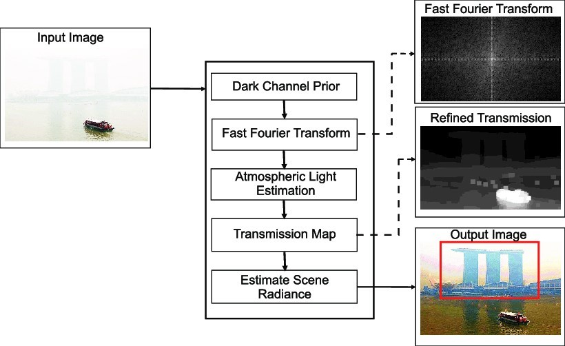
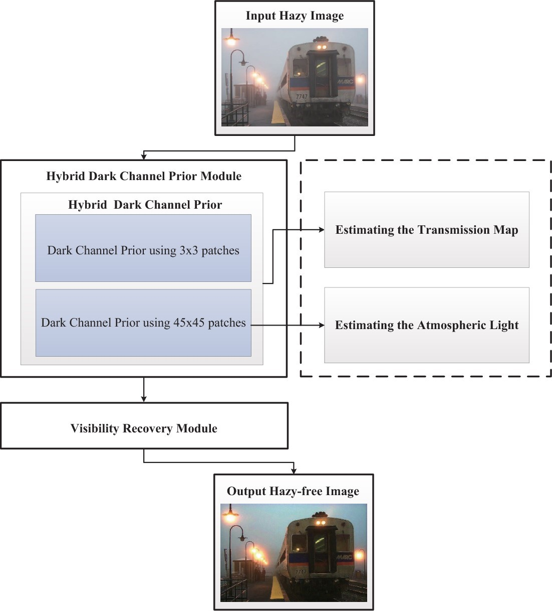
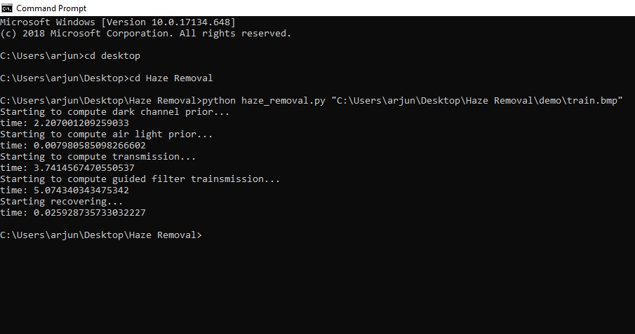
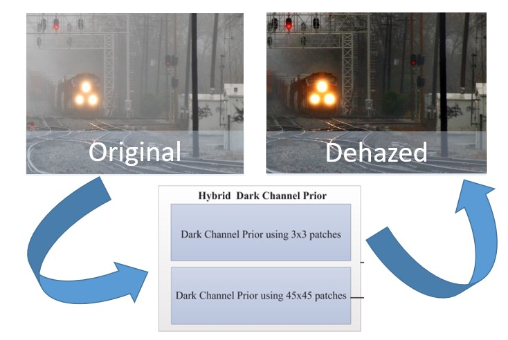

# Haze Removal

## Dependencies

- numpy
- opencv-python
- skimage
- Pillow
- matplotlib
- numba


## Proposed Architecture 


Overview of how Dehazing works using Dark Channel Prior 


The proposed algorithm deals with the dehazing of images by using image degradation model and image restoration based algorithms. Firstly, we apply the Dark Channel Prior method on the image which has been taken as the input. The, apply the Fast Fourier Transform on it, which is an efficient algorithm to compute the discrete Fourier transform and is much less complicated. High pass and low pass filters are respectively used to extract high-frequency and low-frequency components from the image. Dark channel prior method is used for estimation of atmospheric light. Then, the transmission map is calculated using the spectral transform method. Then, finally the haze-free image is restored. 
 
The sequence of steps followed to produce the dehazed enhanced image are: 
*	Applying the Dark Channel Prior on the Input Image 
*	Fast Fourier Transform is then used on the Image 
*	Estimation of Atmospheric Light in the Image 
*	Refinement of the Transmission Map 
*	Refined Transmission Map together with the Atmospheric Estimated before is used to Recover the Original Image 
 

## Flowchart of the proposed algorithm used: 
 
 
 Flowchart of the proposed haze removal approach for visibility enhancement of single images 


## Results
To convert the input hazed image into a recovered dehazed image, we will use the help of the Algorithm in the form of Python script.
To run the Script:
*	Open Command Prompt
*	Change the destination to the Haze Removal folder wherein we have our Python script.
*	To run the script, use the following command:

```
python  <name of script>   <”full path of the input hazed image”>
```

Once the destination provided is correct, the Python script will run the different procedures on the Input Image such as:
*	Computing Dark Channel Prior
*	Computing Air Light Prior
*	Computing Transmission Map
*	Computing Guided Filter Transmission
*	Recovering the Image

Once all the above procedures are executed on the Input Image, the output dehazed will image “test.jpg” will be produced in the same folder.
 
 
Snippet of Command Prompt on how to run the Python script by providing the Image Path
 
 
 

Hazed Image is successfully transformed into Original Dehazed Image using Dark Channel Prior

## Conclusion

After execution of the Algorithm consisting of different procedure running one by one, the fog is removed from the input image using Dark Channel Prior technique after which the image is recovered so as to give us the dehazed image as the output. 
This defogging algorithm is quite efficient and is much more optimized to handle variety of images captured during foggy conditions and guarantees to provide us the original image within no time.


